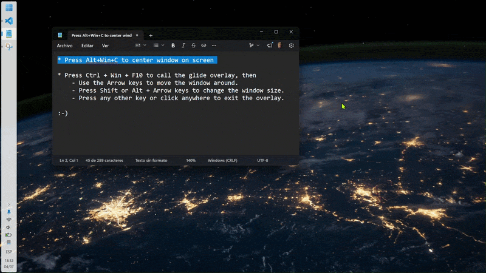

# win-glide

win-glide is a high-performance Windows utility designed for rapid, momentum-based window repositioning using keyboard arrow keys. It prioritizes tactile feedback, precision, and a "snappy yet light" physics model, allowing you to "glide" windows across your desktop with ease.

## Current Status
- **Stable core app:** Keyboard glide, monitor-aware centering, and overlay sync are implemented and passing tests.
- **Overlay resize smoothing:** Resize previews now redraw only when rounded bounds change, which removes redundant overlay churn and makes the resize path feel noticeably smoother.
- **Active feature set:** The app currently supports continuous glide movement, one-shot centering, and continuous overlay-based resize previews with ghost-resize commit at the end of the gesture.
- **Next phase:** The remaining roadmap is productization work such as a tray icon, installer, release build profile, and final v1.0.0 documentation polish.

## Core Features
- **Fluid Keyboard Movement:** Move active windows using arrow keys with high-precision acceleration and friction, powered by a 120Hz physics loop.
- **Instant Window Centering:** Press **`Win + Alt + C`** to center the focused window on its current monitor in one step.
- **Tactile Window Resizing:** Hold **`Shift` + Arrow Keys** to grow/expand borders outwards, or **`Alt` + Arrow Keys** to shrink/pull borders inwards. Resizing uses continuous overlay preview physics and commits the physical window at the end of the gesture.
- **Snappy & Light Physics:** Uses a **Dual-Friction Model** for slow, deliberate acceleration to high speeds while maintaining a nearly instant "glide stop" upon release.
- **Free Multi-Monitor Movement:** Glide windows seamlessly across your entire virtual desktop. Windows can be "parked" partially off-screen while maintaining a safe 150px visible margin.
- **Safe & Responsive:**
    - **Maximized Window Guard:** Prevents accidental movement or resizing of maximized windows.
    - **Panic Exit:** Any other keyboard input or mouse click immediately deactivates the glide session for instant control recovery.

## Security & Privileges
Due to Windows **User Interface Privilege Isolation (UIPI)**, standard-user applications are restricted from interacting with "high-integrity" windows.
- **Task Manager / Elevated Apps:** To move windows belonging to Administrative processes (like Task Manager), you must **Run win-glide as Administrator**.
- **Automatic Detection:** The application will warn you at startup if it's running with limited privileges and will skip activation on restricted windows with a clear console message.

## How to Use
1.  **Launch:** Run the application (`cargo run` or the compiled binary).
2.  **Center (One-Shot):** Press **`Win + Alt + C`** to center the focused window inside the monitor work area (taskbar-aware).
3.  **Activate glide:** Press **`Ctrl + Alt + F10`** while any window is focused to start a "glide" session. The tinted helper overlay will appear over the window.
4.  **Move:** Use the **Arrow Keys** to apply thrust. Acceleration is continuous; hold the keys to reach top speed (~1.3s spin-up).
5.  **Resize:** Hold **`Shift + Arrow Keys`** to expand borders outwards, or **`Alt + Arrow Keys`** to shrink borders inwards. The overlay updates continuously while the physical window is committed at the end of the resize.
6.  **Exit:** 
    - **Keys:** Press **`Esc`** or **any non-arrow/modifier key** to let the window glide to a stop.
    - **Mouse:** **Click anywhere** to instantly deactivate the session.
    - **Timeout:** The session automatically ends after **5 seconds** of inactivity.
    - **Focus Loss:** Switching windows or losing focus will also end the session.




## Configuration
Upon first run, `win-glide` generates a `config.json` next to the running executable. You can customize the physics, resize speed, and hotkeys:

```json
{
  "physics": {
    "acceleration": 3000.0,
    "friction": 10.0,
    "thrust_friction": 0.5,
    "top_speed": 4000.0
  },
  "resize_speed": 600.0,
  "hotkey": {
    "modifiers": 3,
    "vk": 121
  },
  "center_hotkey": {
    "modifiers": 9,
    "vk": 67
  }
}
```
*Note: Acceleration and top speed are in pixels per second. The `resize_speed` field controls the base speed of continuous resizing (Default: 600.0). You can optionally define a `resize_physics` block in `config.json` (similar to the translation `physics` block) for custom resizing momentum and friction; if omitted, resize physics values are computed proportionally based on `resize_speed`. Modifiers (Default: Ctrl+Alt) and Virtual Key (vk) codes follow Win32 standards.*

## Build & Run Requirements
This project targets Windows 10/11 on x86_64 and needs:

- A recent Rust toolchain with `cargo` (installed via [rustup.rs](https://rustup.rs/)).
- **Microsoft Visual C++ Build Tools (MSVC)** including the Windows 10/11 SDK.

### Build and Run
```bash
cargo build --release
./target/release/win-glide.exe
```

### Run Tests
```bash
cargo test
```
*Note: Some tests that register global hooks or hotkeys are marked as `#[ignore]` to avoid failures in non-interactive CI environments. To run all tests locally, use `cargo test -- --ignored`.*

## Developer Notes
- **Graceful Shutdown:** The application uses a thread-safe signaling mechanism. When `App` receives a `Shutdown` event (from `Ctrl+C`), it sends a `WM_QUIT` signal to the background input thread. This ensures that `Drop` implementations for low-level hooks and global hotkeys are executed reliably.
- **DPI Awareness:** The application is `PerMonitorV2` DPI-aware. Movement and rendering are normalized against the current monitor's DPI scaling.
- **Resize Rendering:** Overlay resize previews are intentionally ghost-driven and are only redrawn when the rounded window bounds actually change, which reduces churn and keeps the UI responsive.
- **Testing Hygiene:** System-level tests involving Win32 hooks require an active interactive desktop session. These are gated behind `#[ignore]` to maintain CI stability.

## Development Workflow
This project follows mandatory documentation habits. Detailed technical decisions and bug fixes are recorded in the `.history/` directory.

## License
This project is licensed under the [MIT License](LICENSE).